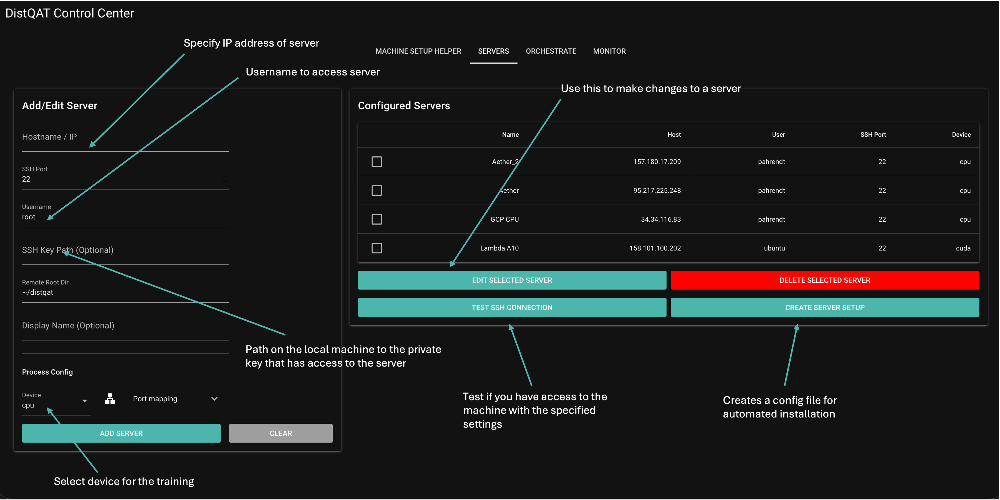
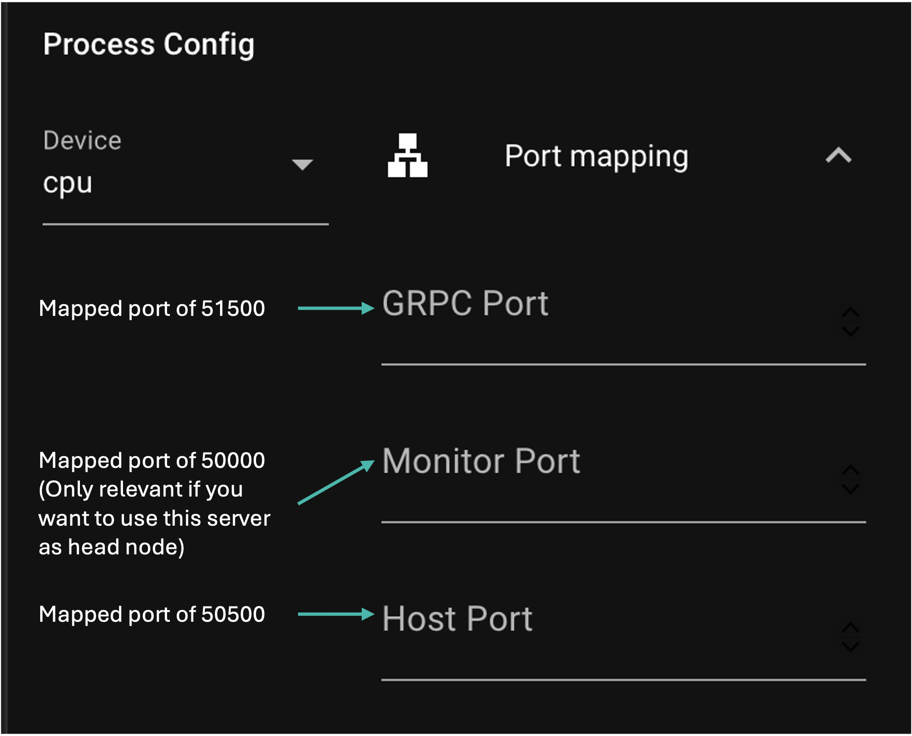
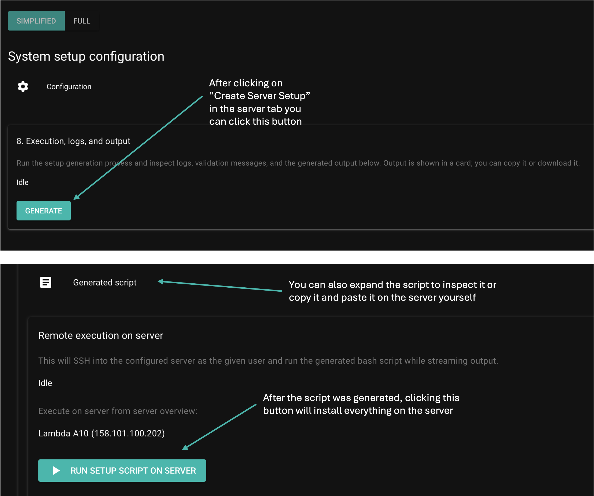
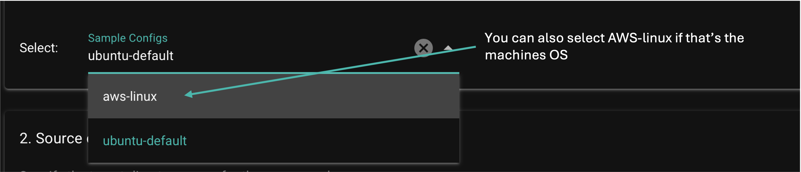
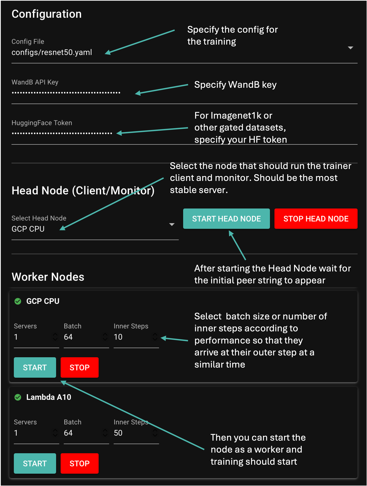
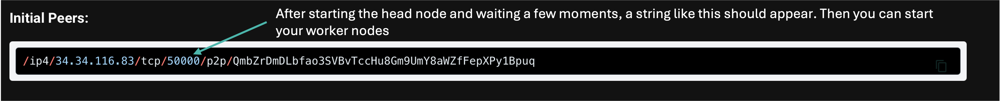
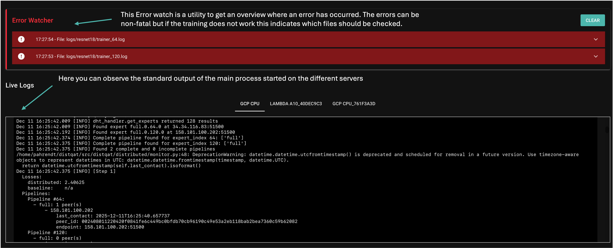
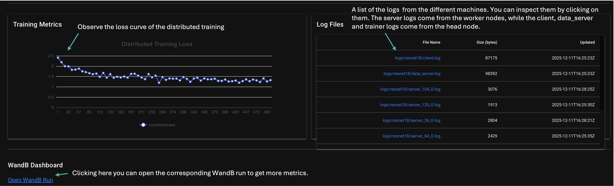

# Quick Start Guide

Get up and running with DistQat in 5 minutes!

## Prerequisites

- Python 3.10+
- Linux OS (Most extensively tested on Ubuntu 22.04 and 24.04 but should work on others as well)
- If using a CUDA- or ROCM-capable GPU you need to install the CUDA or ROCM drivers first
- Allow TCP Ports to be open and accept incoming connection from outside (Ports: 50000-60000 for simplicity or otherwise 50000, 51000, 50500, 51500 are the minimum ports that should be open)
- Optional but highly recommended (especially for the GUI): A WandB account
- Huggingface Token that has access rights to ImageNet1k (https://huggingface.co/datasets/ILSVRC/imagenet-1k) if you want to train on it (eg. ResNet50 config)

> **Note**
> The GUI can also be run on MacOS

##  1. Installation (On your local machine or a server that you don't want to train on)

The GUI is still experimental so some unexpected bugs may arise. However it creates a unified interface that allows you to see all the logs from the different machines in one place, remotely install the framework on your different machines and in general can be helpful to get a better overview of the workflow.

To install the GUI, do the following:

```bash
# Clone repository
git clone https://github.com/SEMRON/aether.git distqat
cd distqat

# Install uv
curl -LsSf https://astral.sh/uv/install.sh | sh

# Source the shell again or start a new shell to make uv available
source $HOME/.local/bin/env

# Create environment
uv venv --python=3.10
source .venv/bin/activate

uv pip install -e .

wandb login
```

Start the GUI on your local machine/ a machine not used for training since it works by SSH'ing into the machines used for training and cannot currently "SSH into itself". This machine needs to be able to access the other machines you want to use for training via SSH. If the other machines are secured through private/ public keys, then you must specify the path to that key file in the GUI when adding one of your servers.

```bash
python run_gui.py [--port <your_preferred_port, 8080 by default>]
```

Also check the std output in the terminal of the GUI process, since some errors might only get shown there. In general however, errors should be shown in the GUI itself.

If running it on a remote machine, you might need to open port forwarding to be able to view the GUI on your local browser:
```bash
# 8080 port is set by default, otherwise specify your preferred port you used when running the GUI
ssh -L 8080:localhost:8080 ubtuntu@xx.xx.xx.xx

# And then open http://localhost:8080
```

##  2. Add and configure the server nodes you want to train on


In the Server tab of the GUI you can add the data of the machines you want to use for the distributed Training. 



> **NOTE**
> You need to have some ports open for the distributed training to work. For more information on which ports to be open, see [Port Assignment ?Pattern](diagrams/NODE_ARRANGEMENT.md#port-assignment-pattern). If the port is open but it is mapped to a different external port you can specify that port by editing the GRPC field for that server in the orchestrator.




##  3. Remotely install the framework on the configured servers

To remotely install the framework, press the `Create Server Setup` button after selecting a server and then follow the instructions—click `Generate` and then `Run Setup Script on Server`. Check the output in the GUI; if no error occurred, the framework should be correctly installed on the machine. Repeat this for every server you want to use. 

Alternatively, you can manually install the framework on each machine by following the [installation instructions](QUICK_START.md#1-installation-on-every-machine-you-want-to-use) in the Quick Start guide.



If the Operating System of your server is not Ubuntu/ Debian based but rather AWS Linux or Fedora then select the `AWS Linux` after expanding configuration.



##  4. Start a training run

In the Orchestrator Tab you can then setup and start the distributed Training.
First you need to start a Head node on one of your machines, this will be the initial peer the worker servers will connect to. At the same time it will also start the monitor which will log the training progress. For this to work seemlessly, specify your WandB API key in the specified field. 

After having started the head node and received the initial peer address, you can start your servers to start the training process. During a training process you can always add a new server and join the ongoing training process.






##  5. Monitor the training run

After starting the training you can switch to the Monitor tab to keep track of your training progress and do some error checking in case anything goes wrong. The log files of the different processes and machines are gathered on WandB and downloaded to the GUI so that the can be live inspected. The Error watcher regularly scans the process and server logs for any errors for a quick overview. Note that it is just a simple error watcher and errors shown here do not necessarily mean, the Training is failing but it can still be a good first insight if something is not working as expected. One example is `[ERROR] hivemind.averaging.averager: Averaging step failed: could not find a group`, in this case the servers did not get the outer step in time, so it will just continue local training and try again at the next outer step.






> **NOTE**
> Currently, the training stops if the GUI is reloaded. That's why for longer training runs it would be recommended to use the manual setup for now.

## 6. Examples
The `resnet18` config should work easily on most machines and does not have much requirements on the hardware. If you want to test out the pipeline parallelism on a small model, then use `resnet18_split.yaml`. This configuration splits the Resnet18 model into two stages. So you need at least 2 servers to train the model. 

## 7. Advanced 
Now if everything works as expected you can dive deeper into the distributed Training. You can test out different models with the GUI based on the provided config files in `configs/*.yaml` or write your own config file. You could also try to implement your own model, although depending on the model complexity that could be more or less challenging. Refer to [Advanced Topics in the README](./README.md#advanced-topics)

## Common Issues

### Leftover Processes
Sometimes when scripts are started and then stopped multiple times, it can lead to errors (eg. the dataserver fails because there is an old dataserver process running). 
`RuntimeError: Timed out waiting for data server manager to start`.
Run the following command and then try running the script again. This is the equvialent of "turn it off and on again".

```bash
pkill -f distqat
```

### Port in Use
```bash
kill -9 $(lsof -t -i:50000)
```

### SSH hangs
Since sometimes we end run multiple SSH commands in quick succession, it can happen that the server blocks SSH requests for a while. In that case you may need to wait a few minutes until you can get a successful SSH connection to that server again.

### CUDA Out-of-memory
Edit `configs/resnet18.yaml`:
```yaml
diloco:
  batch_size_per_step: 16  # Reduce from 64
```

### GRPC Connection refused error
Connection refused, check if port is open and accessible from outside. Will be shown in trainer logs.
If there is port mapping then specify the external port by setting `network-server-base-grpc-announceport` when run from the command line or setting the GRPC port for that server in the GUI. It's the port that's mapped to `51500` by default.

### Failed to connect to bootstrap peer
Check if the IP address of the initial peers is correct and the port is accessible. If port mapping is used then after copying the initial peers you need to change the port so from:
e.g.: `/ip4/213.173.111.105/tcp/50000/p2p/QmPkcZiABVfu41yA3qTF1LpmB9z2ZqjuwjJi2TeBj6fZd6` to `/ip4/213.173.111.105/tcp/<mapped port>/p2p/QmPkcZiABVfu41yA3qTF1LpmB9z2ZqjuwjJi2TeBj6fZd6`

### Hugging face authentication error
`datasets.exceptions.DatasetNotFoundError: Dataset 'ILSVRC/imagenet-1k' is a gated dataset on the Hub. You must be authenticated to access it.`
If you get this error it means the dataset you're trying to use is gated and you need to log in to hugging face either by calling `hf auth login` in the terminal or passing `HF_TOKEN` as an environment variable to your machine.

### Installation SSL: Certificate error 
```
python -m pip install --upgrade certifi \
export SSL_CERT_FILE="$(python -c 'import certifi; print(certifi.where())')"
```

## Next Steps

- Read the [full README](README.md) for detailed documentation
- Check [configuration guide](README.md#configuration) to customize training
- See [examples](README.md#examples) for different models
- Review [troubleshooting](README.md#troubleshooting-faq) for common issues

## File Structure

```
distqat/
├── configs/                 # YAML configuration files
│   ├── resnet18.yaml       # Default config
│   ├── distilgpt2.yaml     # Language model config
│   └── ...
├── src/distqat/
│   ├── distributed/
│   │   ├── monitor.py      # DHT monitoring
│   │   ├── client.py       # Trainer orchestration
│   │   ├── server.py       # Expert hosting
│   │   └── trainer.py      # Training execution
│   └── models/             # Model definitions
├── start_trainer_client.py # Launch coordinator
├── start_servers.py        # Launch workers
└── logs/                   # Training logs (created at runtime)
```

## Monitoring Training

### Check Logs
```bash
# Monitor logs
tail -f logs/resnet18/client.log
tail -f logs/resnet18/server_*.log

# Watch WandB dashboard (if configured)
# Visit https://wandb.ai/your-entity/distqat
```

### Verify Training is Running
Look for these messages in client logs:

```
INFO: Found expert head.0.0.0 at 0.0.0.0:65297
INFO: Complete pipelines: 2 - [0, 1]
INFO:  Spawned trainer 0 with PID 2508688
INFO: Trainer 0 Step #100 loss = 2.34567 sps = 12.5
```

## Stop Training

```bash
# Ctrl+C in the terminal running the process

# Or kill all processes
pkill -f distqat

# Clean up ports if needed
kill -9 $(lsof -t -i:50000)
kill -9 $(lsof -t -i:50500)
kill -9 $(lsof -t -i:51000)
kill -9 $(lsof -t -i:52555)
```

## Test Failover

```bash
python test_failover.py --public-ip ${PUBLIC_IP}
```

This script automatically tests the failover mechanism by killing a server and verifying recovery.

---

**Need Help?** See the [Troubleshooting & FAQ](README.md#troubleshooting-faq) section in the main README.
